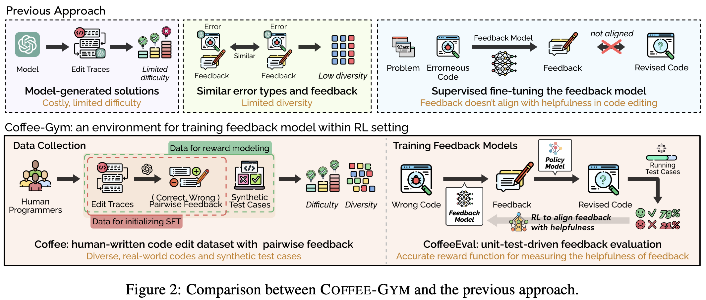

# Coffee-Gym: An Environment for Evaluating and Improving Natural Language Feedback on Erroneous Code

---

The official repository of "Coffee-Gym: An Environment for Evaluating and Improving Natural Language Feedback on Erroneous Code" accepted at EMNLP 2024.

[[Paper](https://aclanthology.org/2024.emnlp-main.1254)] [[Project](https://huggingface.co/spaces/Coffee-Gym/Project-Coffee-Gym)] [[Dataset](https://huggingface.co/datasets/Coffee-Gym)]

<b>Hyungjoo Chae*, Taeyoon Kwon*, Seungjun Moon*, Yongho Song, Dongjin Kang, Kai Tzu-iunn Ong, Beong-woo Kwak, Seonghyeon Bae, Seung-won Hwang, and Jinyoung Yeo</b>

*Equal contribution

Coffee-Gym is an environment for evaluating and improving natural language feedback on erroneous code. Coffee-Gym includes two major components: 
- (1) **Coffee**, a dataset containing humans' code edit traces for coding questions and human-written feedback for editing erroneous code
- (2) **CoffeeEval**, a reward function that faithfully reflects the helpfulness of feedback by assessing the performance of the revised code in unit tests.


<p align="center">
  
</p>

# Coffee


To access Coffee, please refer to the [dataset page](https://huggingface.co/datasets/Coffee-Gym).

# Learning to Generate Feedback within Coffee-Gym

## Training
You can train the feedback model by running the following command:

- SFT
```bash
python ppo/supervised_finetuning.py
```
As we use LoRA for efficient fine-tuning, you have to merge LoRA weights with the base model.
```bash
bash ppo/merge_adapter.sh
```
After merging, you can run RL training.
- Post-training
```bash
python ppo/rl_training.py
```
## Evaluation
When the training is done, you can evaluate the performance of the model by running the following command:
```bash
python ppo/main.py
```

# Citation
```
@inproceedings{chae-etal-2024-coffee,
    title = "Coffee-Gym: An Environment for Evaluating and Improving Natural Language Feedback on Erroneous Code",
    author = "Chae, Hyungjoo  and
      Kwon, Taeyoon  and
      Moon, Seungjun  and
      Song, Yongho  and
      Kang, Dongjin  and
      Ong, Kai Tzu-iunn  and
      Kwak, Beong-woo  and
      Bae, Seonghyeon  and
      Hwang, Seung-won  and
      Yeo, Jinyoung",
    editor = "Al-Onaizan, Yaser  and
      Bansal, Mohit  and
      Chen, Yun-Nung",
    booktitle = "Proceedings of the 2024 Conference on Empirical Methods in Natural Language Processing",
    month = nov,
    year = "2024",
    address = "Miami, Florida, USA",
    publisher = "Association for Computational Linguistics",
    url = "https://aclanthology.org/2024.emnlp-main.1254",
    doi = "10.18653/v1/2024.emnlp-main.1254",
    pages = "22503--22524",
}
```