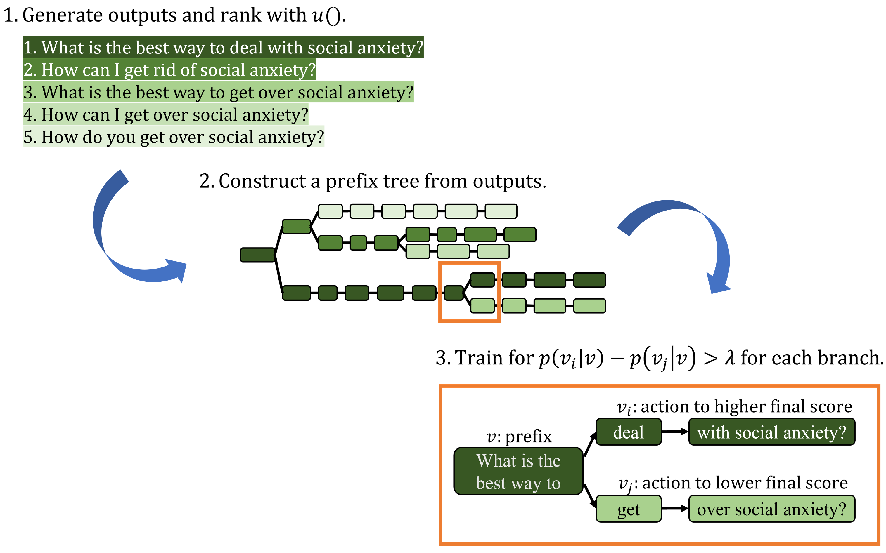

## Learning to Rank Generation with Pairwise Partial Rewards (EMNLP 2023)

## Overview

This directory contains code for the paper "Learning to Rank Generation with Pairwise Partial Rewards" which is accepted to appear at EMNLP 2023.

**Important Note:** The code here is outdated, and we are planning to make the up-to-date version publicly available at [this link](https://github.com/jinulee-v/PairwisePartialReward). All future updates and maintenance work will be carried out in that repository. For the most current code and data, please visit the linked repository.

### Paper description and main idea:

This paper studies the use of reinforcement learning for conditional text generation, which overcomes the limitation of the prevalent supervised maximum likelihood estimation approach. However, it still suffers from challenges including the large action space and the delayed reward, as the reward can be computed only af- ter an entire sequence is generated. To address these challenges, we propose a method that provides partial rewards for intermediate actions taken on partial sequences. This enables the model to promptly prioritize actions that lead to the generation of more desirable sequences. Our method’s key contribution lies in its focus on distinguishing relatively more desirable actions rather than striving to precisely estimate pointwise values for arbitrary partial sequences. Instead, our reward shaping method learns to discern the relative desirability between pairs of actions, or rank actions in a pairwise manner, only when necessary and feasible. This is materialized in an efficient way by leveraging the prefix tree constructed from the sampled sequences. Experimental results on paraphrase generation and lexically constrained machine translation tasks showcase the effectiveness of our method.



### Contribution:

* We introduce a novel method for reward shaping in conditional text generation through pairwise learning to rank.
* We demonstrate the effectiveness of our approach, showcasing not only high-quality generation but also improved estimation of partial sequence values through beam monotonicity and resilience.

## Code Running

Training and evaluation scripts can be found under `scripts/`. For example, to train the MLE baseline model on MSCOCO dataset based on the T5 architecture, run
```
cd scripts
./train_mle.sh <seed> <gpus> T5 MSCOCO
```
after replacing `<seed>` and `<gpus>` to proper values.

## Reference

```
@inproceedings{lee-etal-2023-learning,
    title = "Learning to Rank Generation with Pairwise Partial Rewards",
    author = "Lee, Youngwon  and
      Lee, Jinu  and
      Hwang, Seung-won",
    editor = "Bouamor, Houda  and
      Pino, Juan  and
      Bali, Kalika",
    booktitle = "Proceedings of the 2023 Conference on Empirical Methods in Natural Language Processing",
    month = dec,
    year = "2023",
    address = "Singapore",
    publisher = "Association for Computational Linguistics",
    url = "https://aclanthology.org/2023.emnlp-main.371",
    doi = "10.18653/v1/2023.emnlp-main.371",
    pages = "6078--6092",
}

```

## Acknowledgment
This work was supported by Institute of Information & Communications Technology Planning & Evaluation (IITP) grant funded by the Korean government (MSIT) (No. 2022-0-00077, AI Technology Development for Commonsense Extraction, Reasoning, and Inference from Heterogeneous Data).
